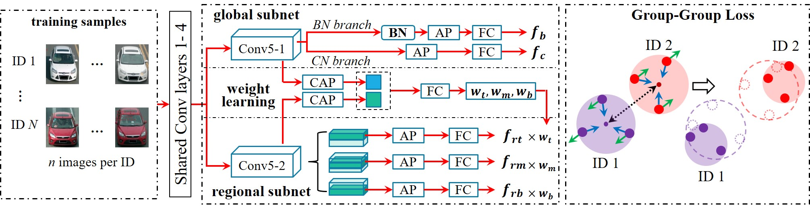

# GGL



There are codes of our TIP paper "Group-Group Loss Based Global-Regional Feature Learning for Vehicle Re-Identification". A pytorch implementation of proposed GGL is provided in MyLoss.py. If you find this help, please kindly cite our paper:<br>
```
@artical{tip-ggl-liu,
  Author = {Liu, Xiaobin and Zhang, Shiliang and Wang, Xiaoyu and Tian, Qi},<br>
  Booktitle = {IEEE Transactions on Image Processing},
  Title = {Group-Group Loss Based Global-Regional Feature Learning for Vehicle Re-Identification},
  Year = {2019}
}
```
